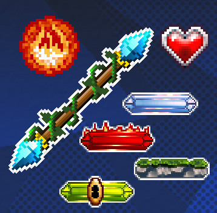
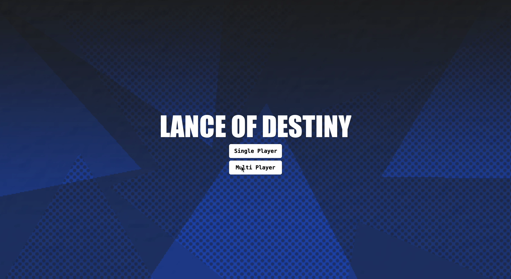
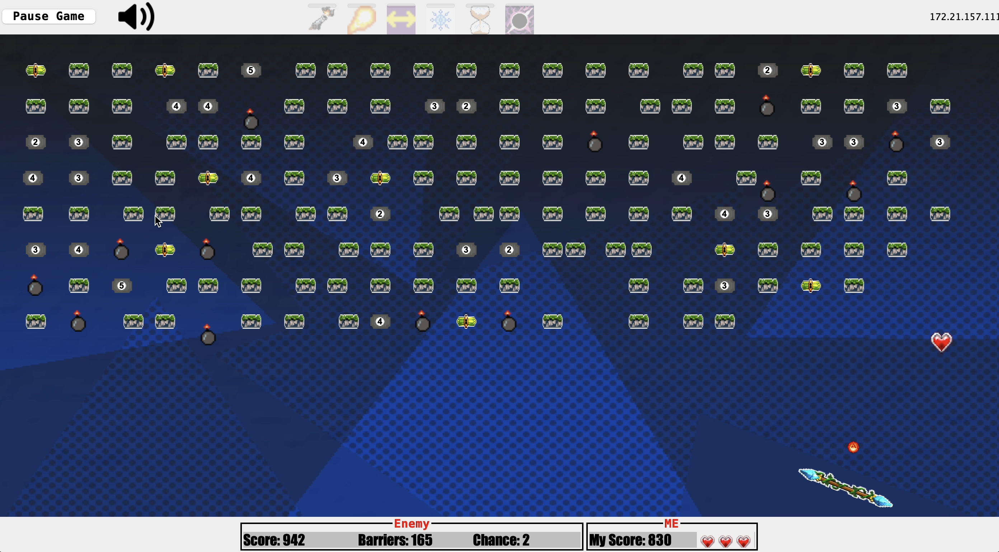
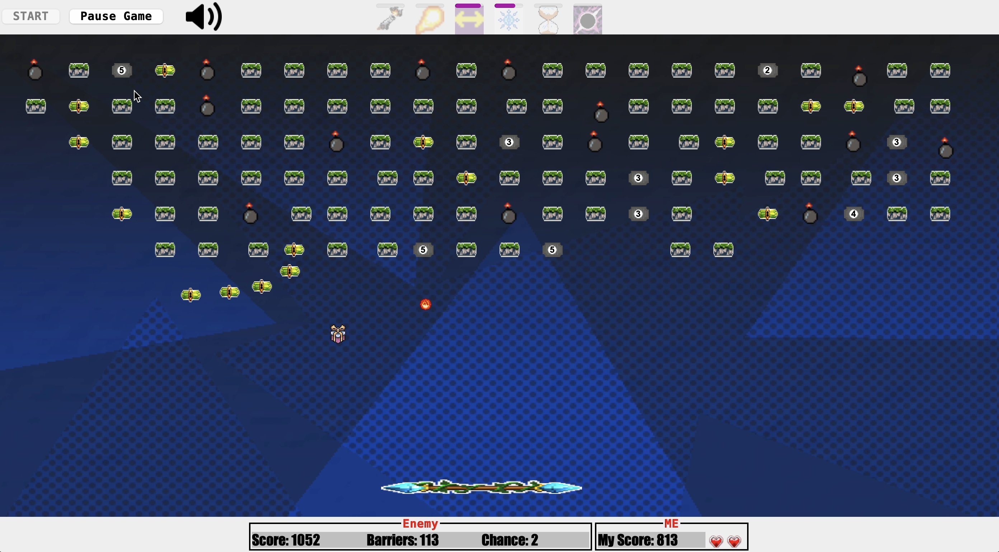

# Lance of Destiny

An exciting 2D game inspired by the classic Brick Breaker, featuring both single-player and multiplayer modes, user authentication, and a robust save/load system.

<p align="center">
  
  
  
</p>

## Overview

**Lance of Destiny** combines fun and challenge in a fast-paced game where players control a Magical Staff to deflect a Fire Ball and break through various barriers. Players can enjoy the game solo or compete against others online, racing to obtain the legendary Lance of Power.

## Key Features

- **Single-Player and Multiplayer Modes**: Play solo or compete with others in real-time.
- **User Authentication**: Secure login system with unique usernames and passwords.
- **Save/Load System**: Save your progress and load it anytime with versioning support.
- **Dynamic Gameplay**: Various barrier types, spells, and power-ups to enhance the gaming experience.
- **Customizable Levels**: Build and customize your own game layouts in Building Mode.

## Gameplay

### Player Actions

- **Move the Magical Staff**: Use the **Left** and **Right** arrow keys to move horizontally.
- **Rotate the Magical Staff**: Tilt using the **A** (left tilt) and **D** (right tilt) keys.
- **Launch the Fire Ball**: Press the **W** key or click the left mouse button.
- **Activate Spells**: Click on spell icons or press designated keys to activate spells.

### Game Objects

#### Magical Staff

- Controlled by the player to deflect the Fire Ball.
- Can move horizontally and temporarily rotate to direct the Fire Ball.

#### Barriers

- **Simple Barrier (Ancient Wall)**: Breaks in one hit.
- **Reinforced Barrier (Triple Rashōmon)**: Requires multiple hits; displays remaining hits.
- **Explosive Barrier (Volatile Fence)**: Explodes on hit; avoid falling debris.
- **Rewarding Barrier (Wish Endower)**: Drops a spell when destroyed.

#### Spells

- **Felix Felicis**: Increases player's chances by 1.
- **Magical Staff Expansion**: Temporarily doubles the staff length.
- **Hex**: Equips the staff with magical cannons to shoot hexes.
- **Overwhelming Fire Ball**: Enhances the Fire Ball to penetrate any barrier.

#### Fire Ball

- The main object used to destroy barriers.
- Bounces off barriers and the Magical Staff.
- Losing the Fire Ball costs the player a chance (3 chances total).

## Game Modes

### Building Mode

- Create or load game layouts with customizable barrier configurations.
- Save your custom levels to play later or share with others.

### Running Mode

- Play the game using the created or loaded layouts.
- In multiplayer mode, compete against other players in real-time.

## Screenshots





## Demo Video

[](https://www.youtube.com/watch?v=your_video_link)

*Click the image above to watch a gameplay demo.*

## Controls

- **Left/Right Arrow**: Move Magical Staff horizontally.
- **A/D**: Rotate Magical Staff.
- **W** or **Left Mouse Click**: Launch Fire Ball.
- **H**: Activate Hex spell.
- **T**: Activate Magical Staff Expansion spell.

## Additional Features

- **User Authentication**

  - Secure login system ensuring each player has a unique profile.
  - Players can load only the games saved under their profile.

- **Save/Load with Versioning**

  - Save your game progress at any time.
  - Load saved games and continue exactly where you left off.
  - Versioning support allows for extensibility and future feature additions.

- **Help Screen**

  - In-game instructions and tips to assist new players.

- **Pause/Resume**

  - Pause the game at any time and resume when ready.

## Installation

1. **Clone the Repository**

   ```bash
   git clone https://github.com/yourusername/lance-of-destiny.git
2. **Open the Project**

Open the project in your preferred Java IDE.

3. **Run the Game**

Open the terminal and right here in this directory run this command ./run.sh

## Technologies Used
- Java SE 17
- Java Swing
- Object-Oriented Design Patterns
- Java Collections Framework
- Networking (for Multiplayer)
- Database Integration (for user authentication and save/load system)

